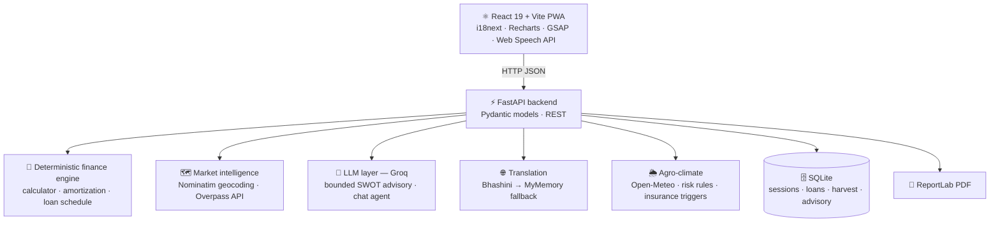

<div align="center">

# 🌾 FinGrow Advisory

### AI business advisory & smart loan scheme platform for rural Indian entrepreneurs

**Location + capital + business idea → a bank-ready feasibility report, in the user's own language, in seconds.**


🏆 **Built for Smart India Hackathon (SIH)**

[Problem](#-the-problem) · [Features](#-features) · [Architecture](#-architecture) · [Getting started](#-getting-started) · [API](#-api-reference) · [Testing](#-testing) · [Contact](#-author)

</div>

---

## 🎯 The problem

Prospective rural micro-entrepreneurs and marginal farmers in India face real barriers to starting a business:

1. **Complex lending schemes** — concessional government loan programmes are hard to navigate
2. **Market blind spots** — no easy way to know if a business is already saturated locally
3. **Language barriers** — banking guidelines are predominantly in English
4. **Climate risk** — crops and livelihoods are exposed to weather shocks and pests
5. **Digital literacy** — keyboard-heavy portals exclude many users

## 💡 The solution

A user provides just **three inputs** — **location**, **available margin capital (₹)** and **business category** (dairy, grocery, poultry, tailoring…). FinGrow then:

- 📍 **Scans real local competitors** within a 5–10 km radius using OpenStreetMap
- 🧮 **Structures a concessional loan** with a deterministic rules engine — no AI in the money math
- 🧠 **Generates a grounded SWOT analysis** with an LLM that is fed only real data
- 🌐 **Translates the advisory** into Hindi or Marathi
- 📄 **Produces a downloadable, bank-ready PDF** with a full amortization schedule
- 🎙️ **Lets users drive the whole app by voice** through a bilingual assistant

---

## ✨ Features

| Module | What it does |
|---|---|
| **Feasibility wizard** | 3-step onboarding that produces a full feasibility report with financials, competitor survey and SWOT |
| **Scheme calculator** | Instant, offline-capable loan structuring with a capital slider and scenario comparison |
| **Loan lifecycle** | Apply → officer approval (with term overrides) → EMI schedule → in-order repayment tracking → CSV statement |
| **Weather & crop risk** | Live Open-Meteo forecast, 0–10 crop-risk score, spray windows, pest outlook and printable spray protocol |
| **Parametric insurance** | Trigger meters (excess rain / dry spell / heat) evaluated against the forecast, plus claim filing with payout estimates |
| **Farm dashboard** | Harvest lots and revenue, loan portfolio and cash-flow, co-op activity feed, notifications built from real state |
| **Market & suppliers** | Mandi commodity price board and an OSM-powered nearby supplier map |
| **Voice & chat agent** | Floating assistant using the Web Speech API + LLM chat with intent detection that navigates the app |
| **Multilingual UI** | English, हिन्दी and मराठी via i18next, with jargon tooltips for financial terms |
| **Share & export** | ReportLab vector PDF reports and WhatsApp sharing |
| **PWA** | Installable with offline caching for low-connectivity areas |

---

## 🏗 Architecture



### 🔐 Design principle: no hallucinated money

Financial structuring is **never delegated to an LLM**. All loan math lives in rule-based, fully tested Python:

| Rule | Formula / gate |
|---|---|
| Project cost | `Margin capital ÷ 0.10` |
| Loan amount | `Project cost × 0.90` |
| Micro Finance Scheme | Project cost ≤ ₹1,40,000 → 6.5% p.a., 36 months, 3-month moratorium |
| Term Loan Scheme | ₹1,40,000 < project cost ≤ ₹50,00,000 → 8.0% p.a., 84 months, 6-month moratorium |
| Out of bounds | Project cost > ₹50,00,000 → rejected |
| Repayment | Reducing-balance amortization, interest-only during moratorium |

The LLM receives **real competitor density and computed financials as ground truth**, and its system prompt explicitly forbids inventing demographics or market statistics. When an external service is unavailable, the app degrades gracefully instead of failing.

---

## 🛠 Tech stack

| Layer | Technology |
|---|---|
| **Frontend** | React 19, Vite, Tailwind CSS v4, Recharts, GSAP, react-i18next, vite-plugin-pwa |
| **Backend** | Python 3.10+, FastAPI, Uvicorn, Pydantic v2, httpx |
| **AI / NLP** | Groq (`openai/gpt-oss-120b` advisory, Llama 3.x chat), Bhashini + MyMemory translation |
| **Geo & data** | OpenStreetMap Nominatim + Overpass, Open-Meteo |
| **Persistence** | SQLite |
| **Reports** | ReportLab (vector PDF), SVG charts |
| **Testing** | pytest, pytest-asyncio — 131 tests |
| **DevOps** | Docker, Docker Compose (health-checked services), Nginx, Vercel config |

---

## 🚀 Getting started

### Option 1 — Docker Compose (recommended)

```bash
git clone https://github.com/tan8696/Fingrow-.git
cd Fingrow-
cp backend/.env.example backend/.env   # add your GROQ_API_KEY
docker compose up --build
```

- Frontend → http://localhost:5173
- API docs (Swagger) → http://localhost:8000/docs

### Option 2 — Run locally

**Prerequisites:** Python 3.10+, Node.js 18+

**Backend**
```bash
cd backend
python -m venv venv
source venv/bin/activate          # Windows: venv\Scripts\activate
pip install -r requirements.txt
cp .env.example .env              # add your GROQ_API_KEY
uvicorn app.main:app --reload --port 8000
```

**Frontend**
```bash
cd frontend
npm install
npm run dev                       # http://localhost:5173
```

### Environment variables

| Variable | Required | Purpose |
|---|---|---|
| `GROQ_API_KEY` | For AI reports & chat | Groq API key |
| `GROQ_MODEL` | No | Advisory model (default `openai/gpt-oss-120b`) |
| `BHASHINI_API_KEY` / `BHASHINI_USER_ID` | No | Primary translation provider; falls back to MyMemory |
| `CORS_ORIGINS` | No | Comma-separated allowed frontend origins |
| `SESSION_DB_PATH`, `LOANS_DB_PATH`, `HARVEST_DB_PATH`, `ADVISORY_DB_PATH` | No | SQLite file locations |

> 💡 The standalone calculator (`POST /api/calculate`) needs **no API keys** at all.

---

## 📡 API reference

Full interactive docs are served at `/docs`. Highlights:

| Area | Endpoints |
|---|---|
| **Reference** | `GET /api/health` · `GET /api/categories` · `GET /api/languages` |
| **Calculator** | `POST /api/calculate` |
| **Feasibility** | `POST /api/generate-report` · `GET /api/report/{session_id}/pdf` |
| **Loans** | `POST /api/loans/apply` · `POST /api/loans/{id}/approve` · `GET /api/loans/{id}/repayment` · `POST /api/loans/{id}/repayments/{month}` · `GET /api/loans/{id}/statement` · `GET /api/loan-history` |
| **Weather & insurance** | `GET /api/weather` · `GET /api/weather/protocol` · `GET /api/insurance/policy` · `POST/DELETE /api/insurance/claims` · `GET/POST/DELETE /api/reminders` |
| **Dashboard** | `GET/POST/DELETE /api/harvest` · `GET /api/portfolio` · `GET /api/portfolio/cashflow` · `GET /api/cluster/activity` · `GET /api/notifications` · `GET /api/market-prices` |
| **Assistant** | `POST /api/chat` |

<details>
<summary><b>Example — <code>POST /api/calculate</code></b></summary>

**Request**
```json
{ "margin_capital": 25000 }
```

**Response (abridged)**
```json
{
  "financials": {
    "margin_contribution": 25000.0,
    "project_cost": 250000.0,
    "loan_amount": 225000.0,
    "selected_scheme": "Term Loan Scheme",
    "interest_rate_pct": 8.0,
    "tenure_months": 84,
    "moratorium_months": 6
  },
  "amortization": {
    "quarterly_emi": 11155.0,
    "total_quarters": 28,
    "schedule": ["..."]
  }
}
```
</details>

<details>
<summary><b>Example — <code>POST /api/generate-report</code></b></summary>

```json
{
  "location": "Rampur Village, Barabanki, UP",
  "margin_capital": 25000,
  "business_category": "dairy",
  "language": "hi",
  "radius_km": 10.0
}
```
Returns financials, the amortization schedule, an OSM competitor survey and a translated SWOT analysis.
</details>

---

## 🧪 Testing

**131 automated tests** cover the parts of the system where correctness matters most:

| Suite | Coverage |
|---|---|
| `test_calculator.py` | Scheme thresholds and boundaries, 10× project cost, 90% loan, ₹50L cap |
| `test_amortization.py` | Moratorium schedules, reducing-balance math, zero final balance |
| `test_loan_store.py` · `test_loan_schedule.py` | Persistence, monthly EMI math, CSV statements |
| `test_api.py` | Apply → approve → repay flow, conflict handling, insurance, reminders, notifications (weather feed stubbed) |
| `test_weather.py` · `test_agro.py` | WMO code mapping, crop-risk rules, spray windows, insurance triggers, payout math |
| `test_harvest_store.py` · `test_portfolio.py` | Harvest revenue summaries and portfolio aggregation |
| `test_session_store.py` · `test_report.py` | SQLite session durability, SVG charts, PDF generation |

```bash
cd backend
python -m pytest tests -v
```

---

## 📁 Project structure

```
Fingrow-/
├── backend/
│   ├── app/
│   │   ├── api/          # FastAPI routes & Pydantic models
│   │   ├── core/         # Finance engine, geo, weather, agro, LLM, translation, stores
│   │   └── report/       # HTML/SVG + ReportLab PDF generation
│   ├── agent/skills/     # Agent skill modules (scheme financials, OSM, voice stream)
│   ├── tests/            # pytest suite
│   └── Dockerfile
├── frontend/
│   ├── src/
│   │   ├── components/   # Dashboard, wizard, calculators, maps, voice agent…
│   │   ├── hooks/        # API, offline cache, voice & location hooks
│   │   └── locales/      # en · hi · mr translations
│   ├── nginx.conf
│   └── Dockerfile
└── docker-compose.yml
```

---

## 🗺 Roadmap

- [ ] Live mandi price feed integration (currently a simulated feed)
- [ ] Complete Bhashini onboarding for all 22 scheduled Indian languages
- [ ] SMS / IVR channel for feature phones
- [ ] Bank-officer portal with role-based authentication

---

## 👤 Author

**Tanish Lather** — Full-stack developer

[](https://github.com/tan8696)
[](https://www.linkedin.com/in/tanish-lather-27456b40a)
[](mailto:tanishla1100@gmail.com)

💼 *Open to freelance and full-time opportunities — feel free to reach out.*

---

## 📄 License

MIT License. Developed for the Smart India Hackathon.
